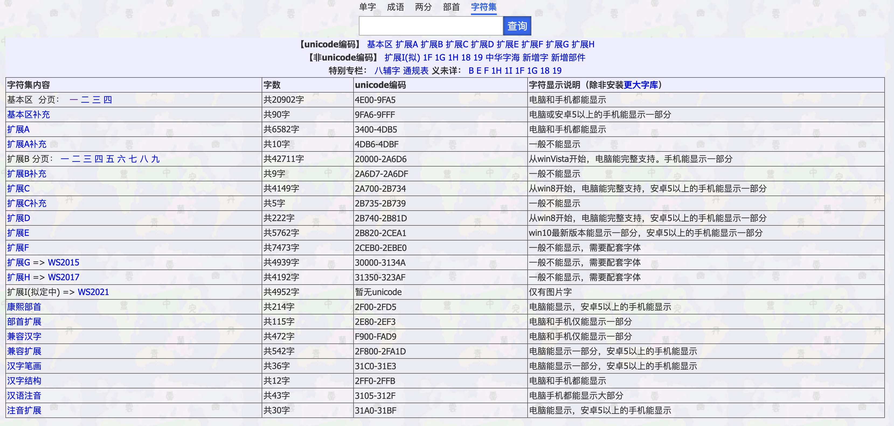
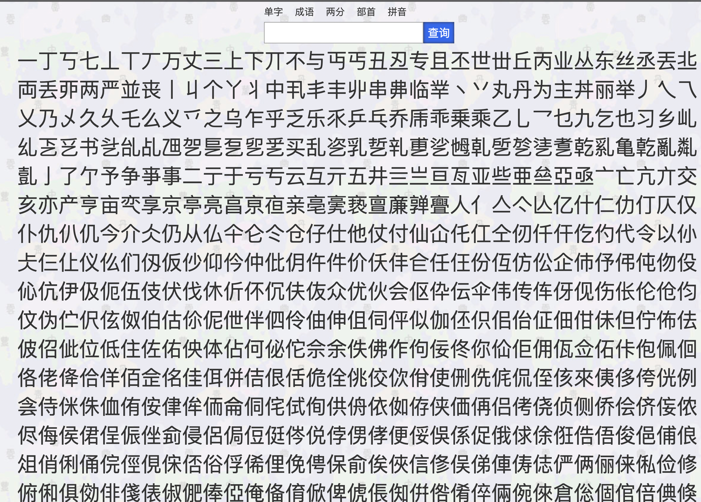
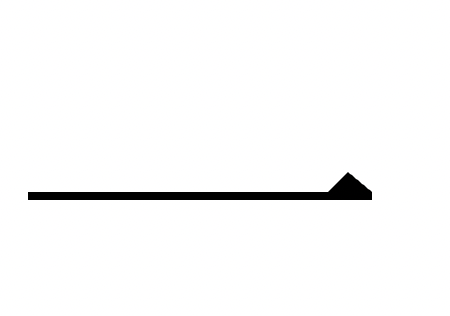

### 有关爬虫的相关文件

### 爬虫大体逻辑：

1. 在[字海网](http://www.rendao.com/zsts.htm)上，查询出所有的中文分区：
2. 挨个进入每个分区，保存该分区下的字，将所有分区下的所有的字都保存到 font.txt 文件中
3. 从 font.txt 文件中取出每个字转成 unicode 码去[字形维基](http://zhs.glyphwiki.org/wiki/GlyphWiki:%e5%85%b3%e4%ba%8e%e5%ad%97%e5%bd%a2%e7%bb%b4%e5%9f%ba)上查询对应字的 svg 图片 url 的拼接规则http://zhs.glyphwiki.org/glyph/{unicode码}.svg然后保存下来。例如：一这个字段 svg 图[地址](http://zhs.glyphwiki.org/glyph/u4e00.svg)

    

### 注意事项：

项目是半年前写的了，当时只是为了拿到数据在本地多个代码库随意调试的，现整理代码，部分文件路径等可能不对，发现可以联系我 QQ：1830695417。

简介一下使用到的部分库：cheerio 一个可以运行在 node 环境下的 jquery 库，可用于快速选择 DOM 提取数据，避免写繁琐正则去提取。
